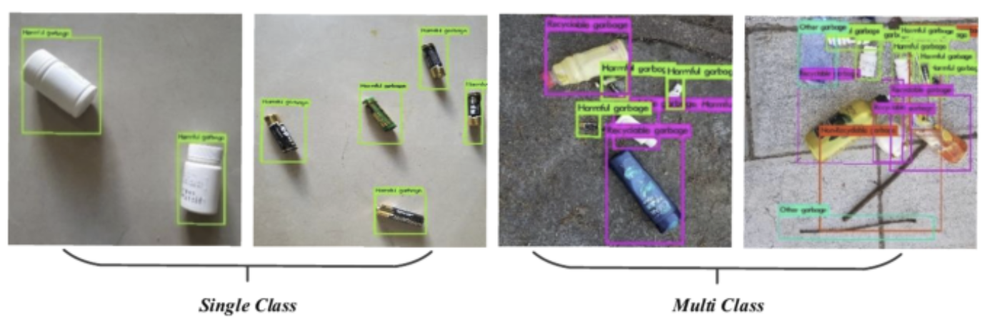
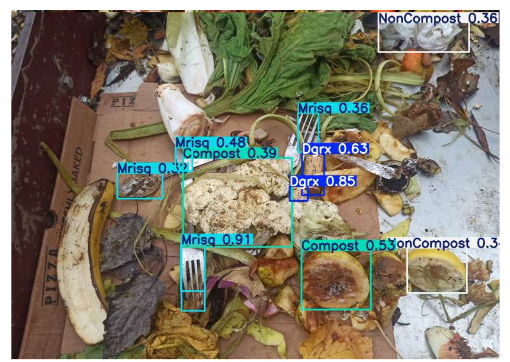

# Contexte :

La gestion efficace des composts collectifs est essentielle pour réduire les
déchets et encourager le recyclage organique. Toutefois, la présence de
matériaux inappropriés (plastiques, métaux, verre, etc.) reste un problème
récurrent, affectant la qualité et la sécurité du compost final. Une solution
préventive est indispensable pour garantir un compostage optimisé, durable et
respectueux de l’environnement.

# Objectif :
Ce projet vise à concevoir une solution automatisée capable d’analyser les
déchets avant leur intégration dans le compost collectif. Le système s’appuiera sur une intelligence artificielle (IA) pour examiner le contenu des poubelles à l’aide d’une caméra connectée. 
- En cas de détection d’anomalies (objets non compostables), les
gestionnaires pourront intervenir pour retirer les éléments inappropriés.
- Si aucun problème n’est détecté, les déchets seront ajoutés directement
au compost principal.
---

## 📸 Aperçu

---
## Problématique  
Pour entraîner une IA, il nous faut des données adaptées à notre situation.  

Les données sont constituées d’images contenant des déchets, accompagnées d’annotations :  
- des boîtes englobantes (coordonnées) pour la détection des objets ;  
- une classe associée à chaque boîte afin de définir à quelle catégorie appartient l’objet.  

Il existe des données annotées en open source, mais elles ne correspondent pas aux données cibles (c’est-à-dire des déchets compostables, partiellement broyés et mélangés sur un plateau).  

---

## Il faut annoter des données  

### Premier livrable : conception d’un outil d’annotation de données avec IA intégrée  

Nous utilisons des données open source pour entraîner une première version de notre IA.  
Puis, nous utilisons cette IA pour nous aider à annoter de nouvelles images.  

Une fois ces nouvelles images annotées, nous réentraînons notre IA.  

Ce processus itératif pourra être répété plusieurs fois afin d’augmenter progressivement les performances.  

## 🎥 Démo vidéo

