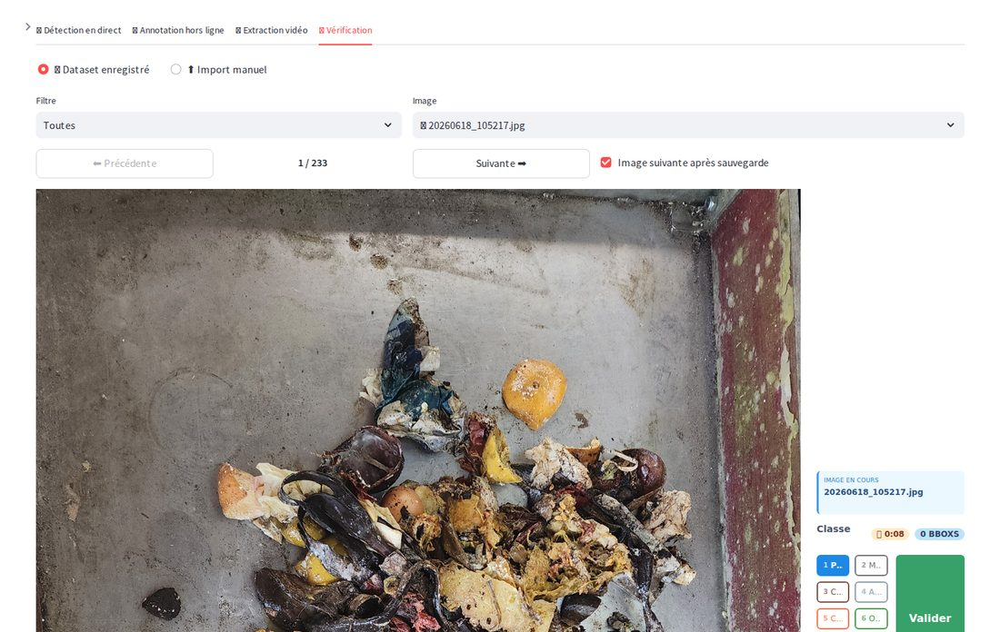
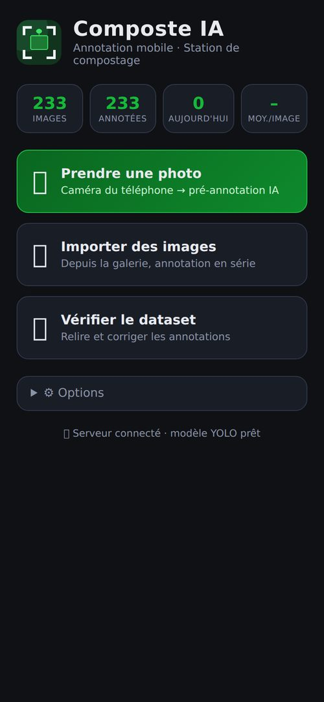
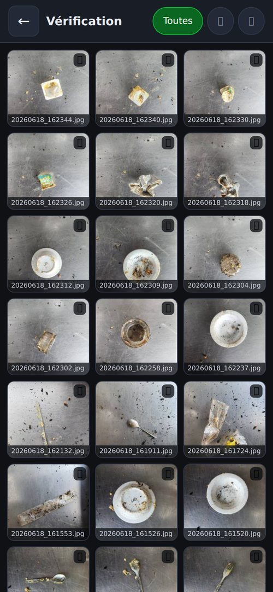
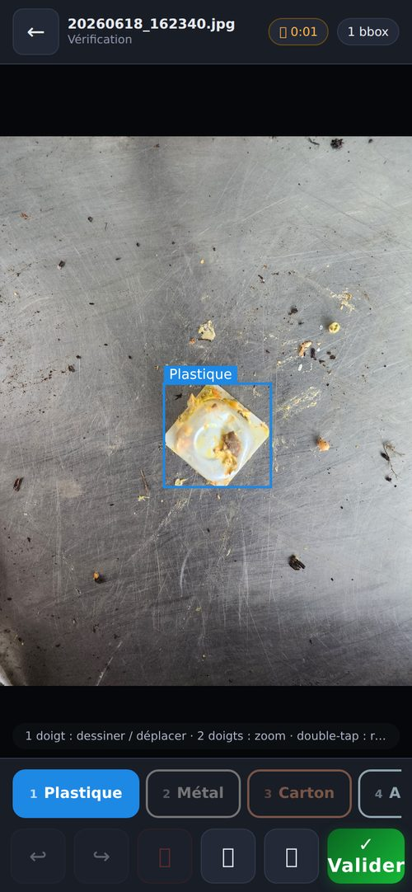

# Rapport technique — 09/07 : améliorations de l'outil d'annotation + version mobile

**Deux volets :** (1) amélioration de l'interface d'annotation PC existante,
(2) création d'une version tablette/smartphone.

---

## Volet 1 — Améliorations de l'interface PC (Streamlit + composant React/Konva)

### Éditeur de bounding boxes (composant `bbox_editor`)

| Ajout | Détail |
|---|---|
| **Undo / Redo** | Ctrl+Z / Ctrl+Y (ou boutons ↩ ↪) — historique de 60 actions : ajout, déplacement, redimensionnement, suppression, changement de classe |
| **Suppression au clavier** | Touche `Suppr`/`Backspace` ou bouton 🗑 sur la bbox sélectionnée (jusqu'ici : uniquement clic molette, impossible au trackpad/tactile) |
| **Échap** | désélectionne la bbox courante |
| **Support tactile** | 1 doigt = dessiner, 2 doigts = pinch-zoom + déplacement de la vue, double-tap = reset zoom, tap = sélection (utile PC hybrides/écrans tactiles) |
| **Poignées élargies** | ancres de redimensionnement 12 px (plus faciles à attraper) |

**Bug corrigé au passage :** un simple clic sur une zone vide (sans glisser)
créait une bbox fantôme de 5×5 px — du bruit invisible qui polluait les labels
du dataset. Un seuil de 4 px de glissement est désormais requis.

### Application Streamlit (`app.py`)

- **Onglet Vérification refondu** : il fallait auparavant uploader manuellement
  l'image **et** son fichier `.txt` — impraticable pour relire un dataset de
  233 images. Désormais l'onglet **parcourt directement `dataset_recolte/`** :
  liste déroulante des images (✅ annotée / ⬜ sans annotation), filtre,
  boutons Précédente/Suivante, chargement automatique du label, sauvegarde en
  place, option « image suivante après sauvegarde » pour relire le dataset à la
  chaîne. Bouton « 🤖 Pré-annoter » pour les images sans label. L'import manuel
  reste disponible en secours.
- **Protection anti-écrasement** : sauvegarder une image portant le même nom
  qu'une image existante mais au **contenu différent** (collision entre deux
  lots) écrasait silencieusement l'ancienne. Désormais : contenu identique →
  ré-annotation en place (comportement voulu) ; contenu différent → suffixe
  `_2`, `_3`…
- **Stats dans la sidebar** : nombre d'images / annotées, annotations du jour
  et temps moyen par image (lu depuis `annotation_times.csv`).
- `settings.py` : chemins absolus (l'import ne dépend plus du dossier de
  lancement) ; nettoyage de CSS mort ; `.gitignore` complété (zip de 1,2 Go,
  fichiers `Zone.Identifier`, `.claude/`).



---

## Volet 2 — Version mobile : PWA + serveur FastAPI (`mobile/`)

### Pourquoi ce format ?

Formats envisagés :

| Option | Verdict |
|---|---|
| App native (Android/iOS) | ❌ 2 codebases, stores, et surtout : impossible de faire tourner le YOLO du projet sur téléphone simplement |
| Rendre l'app Streamlit responsive | ❌ Streamlit reste lourd sur mobile, et le composant Konva était inutilisable au doigt ; reruns serveur à chaque interaction |
| **PWA servie par le PC (choisi)** | ✅ zéro installation (un navigateur suffit, iOS + Android), installable sur l'écran d'accueil, le modèle **reste sur le PC**, interactions tactiles 100 % côté client (fluide), même dataset |

Architecture : le téléphone n'est qu'un **écran tactile**, le PC garde
l'intelligence et le stockage.

```
┌─────────────┐   photo (WiFi local)    ┌────────────────────────────┐
│  Téléphone   │ ──────────────────────▶ │  PC : FastAPI + YOLO       │
│  (PWA)       │ ◀────────────────────── │  → dataset_recolte/        │
└─────────────┘   bboxes pré-annotées    └────────────────────────────┘
```

### Ce que fait l'application

- **📷 Prendre une photo** (caméra du téléphone) → pré-annotation IA →
  correction au doigt → **Valider** : l'image + le label YOLO tombent dans le
  même `dataset_recolte/` que la version PC. *Cas d'usage terrain : annoter
  directement à la station de compostage.*
- **🖼 Import galerie** : annotation en série avec file d'attente et progression.
- **🔍 Vérification** : galerie de miniatures du dataset (filtres), correction
  en place des annotations existantes.
- **Éditeur tactile** (canvas vanilla JS, écrit sur mesure) : 1 doigt =
  dessiner / déplacer / redimensionner via poignées ; 2 doigts = pinch-zoom +
  pan ; double-tap = recadrage ; undo/redo ; chrono par image.
- **Cohérence des données** : classes et couleurs lues depuis `helper.py`
  (source unique), même format YOLO, même logique anti-collision de noms, et
  les temps d'annotation sont journalisés dans le **même CSV** avec
  `source=mobile` → les statistiques de productivité restent unifiées.

| Accueil | Galerie | Éditeur |
|---|---|---|
|  |  |  |

### Choix techniques notables

- **Vanilla JS, zéro dépendance, zéro build** côté front (~600 lignes) : pas de
  `npm install`, pas de compilation — contraste volontaire avec le composant
  React/Konva du PC qui nécessite un rebuild à chaque modification.
- **Pointer Events** : une seule gestion unifiée souris + doigt + stylet.
- **Miniatures côté serveur** (`/api/thumb`, 256 px, cache disque) : les photos
  du dataset font 3000×4000 (plusieurs Mo) — la galerie serait inutilisable en
  servant les originaux.
- **PWA** : manifest + service worker (cache de l'app shell). En HTTP sur le
  LAN, l'app fonctionne comme un site classique — c'est l'usage normal ;
  l'installation plein écran est un bonus.
- La capture caméra passe par `<input capture="environment">` (fonctionne en
  HTTP, contrairement à `getUserMedia` qui exigerait HTTPS).

### Lancement (démo)

```bash
python mobile/server.py     # affiche l'IP à ouvrir sur le téléphone
```

---

## Difficultés rencontrées (et solutions)

1. **`hidden` vs CSS `display:flex`** — l'overlay de chargement gardait
   `display:flex` malgré l'attribut HTML `hidden` (les styles auteur écrasent
   le style navigateur de `hidden`) : un calque invisible bloquait **tous** les
   événements tactiles du canvas. Trouvé grâce aux tests navigateur
   automatisés ; corrigé par `.spinner-overlay[hidden]{display:none}`.
2. **Rangées de galerie écrasées** — `aspect-ratio` sur la vignette +
   `height:100%` sur l'image = circularité de layout : rangées de 2 px et
   vignettes superposées (reproductible sur téléphone réel, même moteur).
   Corrigé en portant l'aspect-ratio sur l'image + `grid-auto-rows` plancher.
3. **Image orpheline en cas d'annotation invalide** — le serveur écrivait
   l'image avant de valider les annotations ; une requête malformée laissait
   une image sans label dans le dataset. Validation désormais **avant** toute
   écriture (détecté par les tests de bout en bout, qui ont eux-mêmes créé
   l'orpheline).
4. **`settings.py` dépendant du répertoire de lancement**
   (`relative_to(Path.cwd())`) — cassait tout import hors `streamlit run` à la
   racine. Passage en chemins absolus.
5. **Undo/redo dans le composant React existant** — le "clamping" des bboxes
   se faisait dans un `useEffect` qui re-modifiait l'état à chaque rendu
   (historique pollué par des entrées parasites). Refactoré : normalisation au
   moment de l'action (création/déplacement/resize), et séparation
   sélection (hors historique) / modification (historisée).

## Tests effectués

- **PC** : `streamlit.testing.AppTest` exécute réellement `app.py` (0
  exception, 4 onglets, 233 images listées dans Vérification) + test navigateur
  (Playwright) de l'onglet Vérification et du composant rebuilé.
- **API mobile** : script de bout en bout — predict sur vraies images (bboxes
  pixel exactes), save (fichier YOLO vérifié à la main : classes, centres,
  tailles normalisées), ré-annotation même contenu → même nom, collision →
  suffixe `_2`, ligne CSV `source=mobile`, `label_id` invalide → HTTP 400,
  traversée de chemin (`../`) → 404.
- **UI mobile** : Playwright en viewport smartphone tactile — accueil, galerie
  (233 miniatures), ouverture d'une image + label existant, **dessin au doigt,
  undo/redo, sélection, déplacement, suppression**, changement de classe,
  highlight, navigation retour ; zéro erreur JS.

## Limites connues / pistes

- Deux personnes peuvent annoter en même temps (PC + mobiles) ; en revanche si
  deux personnes corrigent **la même image** en même temps, le dernier qui
  sauvegarde gagne.
- Le service worker ne met pas les images en file hors-ligne : sans WiFi, pas
  d'annotation (pré-annotation IA impossible hors ligne de toute façon).
  Piste : file d'attente IndexedDB synchronisée au retour du réseau.
- Piste : bouton « supprimer l'image du dataset » (avec corbeille) dans l'onglet
  Vérification pour purger les mauvaises captures.

## Fichiers

- **Modifiés** : `app.py`, `settings.py`, `annotation_timer.py`,
  `requirements.txt`, `.gitignore`, `tuto_installation.md`,
  `bbox_editor/frontend/src/*.tsx` (+ rebuild du composant).
- **Créés** : `mobile/server.py`, `mobile/static/{index.html, app.js,
  style.css, manifest.webmanifest, sw.js, icons/}`, `mobile/README.md`,
  `docs/captures/*.jpg`.
